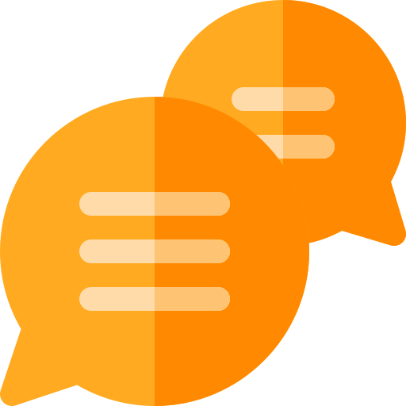
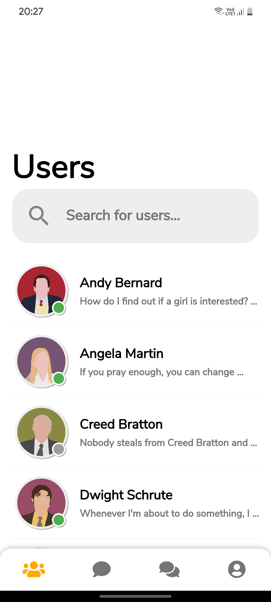
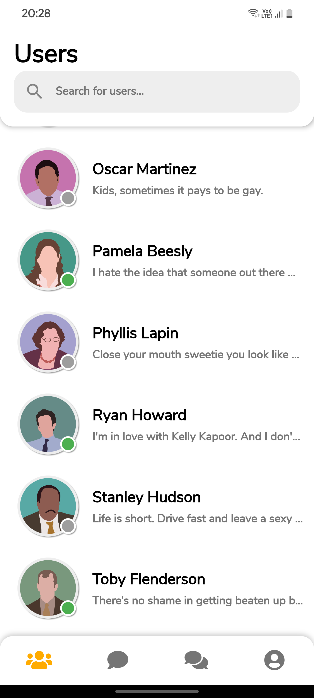
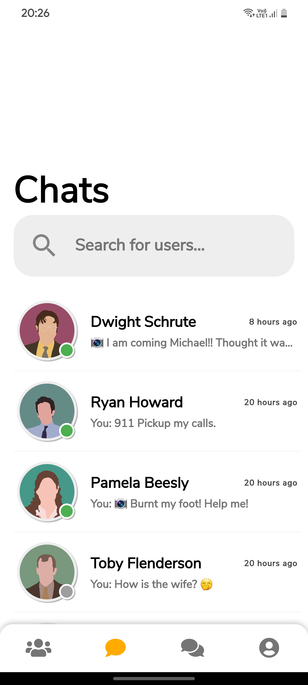
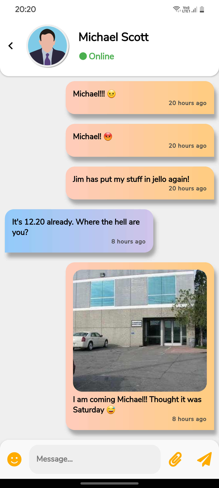
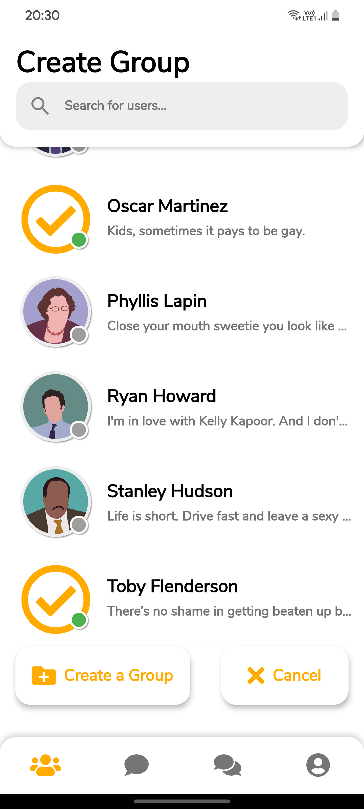
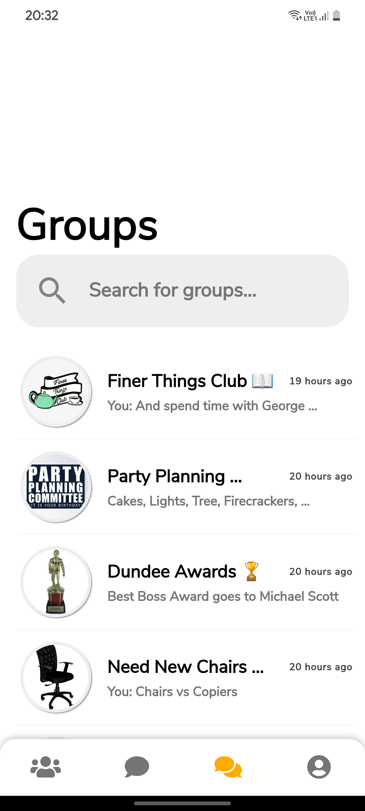
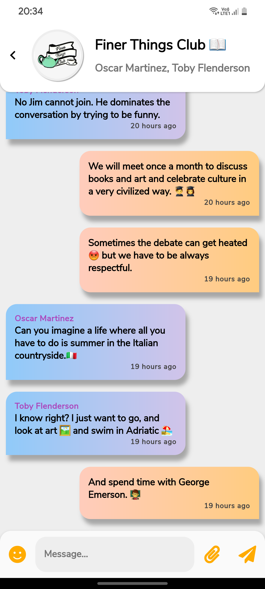
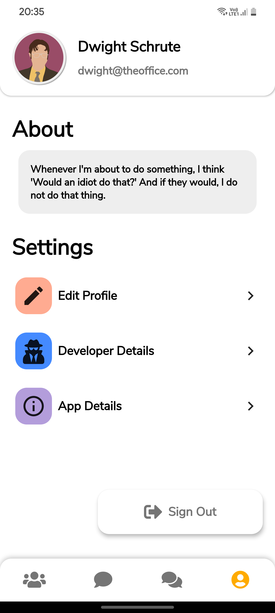

# Wuphf Chat 

Chat with friends or make new ones. Create groups to hangout. Send pics and emojis. Made with Flutter.

  

  
## Details

• [BLOC](https://github.com/felangel/bloc/tree/master/packages/flutter_bloc) for State Management Library

• [Firebase Auth](https://firebase.google.com/docs/auth) for User Authentication

• [Cloud Firestore](https://firebase.google.com/docs/firestore) as the Database

• [Cloud Functions](https://cloud.google.com/functions) & [Firebase Cloud Messaging](https://firebase.google.com/docs/cloud-messaging) for Notifications & User Presence

• [Cloud Storage](https://cloud.google.com/storage) to store all images

• [RxDart](https://pub.dev/packages/rxdart) for combining Streams

## Screenshots
       

### Wuphf Chat is a full fledged chatting app that is made with Flutter.

Name is inspired from an episode in The Office(American Sitcom).

<b>*** Please Make Sure You Have A High Speed Internet Connection ***</b>

• 1 to 1 Private Chats – Talk with your friends in private messaging.

• Group Chats – Create groups with others and hangout.

• Notifications Support – Get notifications for new messages and groups.

• Send Pictures – Send pictures from your phone to a friend with just a few clicks.

• Open Source – Wuphf Chat is a completely open source app made by a single developer from scratch. No advertisements. No trackers.

• Global – You can chat with anyone who has created an account on the app. You don't have to have their contact details or be their friend.

<b>
<u>Disclaimer:</u>
This app is purely made for learning purposes. Please treat it as so. DONT try to use it as your primary chatting app.
</b>

For support, questions, or more information, please mail: contact@ankan.dev

Checkout my site ([ankan.dev](https://ankan.dev)) or follow me on ([Twitter](https://twitter.com/ankan_sikdar)) and ([Instagram](https://www.instagram.com/ankan_sikdar)) for any updates.

## Legal Things
### Privacy Policy
[Click here to read the privacy policy](https://wuphf-chat-privacy-policy.web.app).

### License

Licensed under the GPLv3: http://www.gnu.org/licenses/gpl-3.0.html

Google Play and the Google Play logo are trademarks of Google LLC.
Icons made by Freepik (https://www.flaticon.com)
